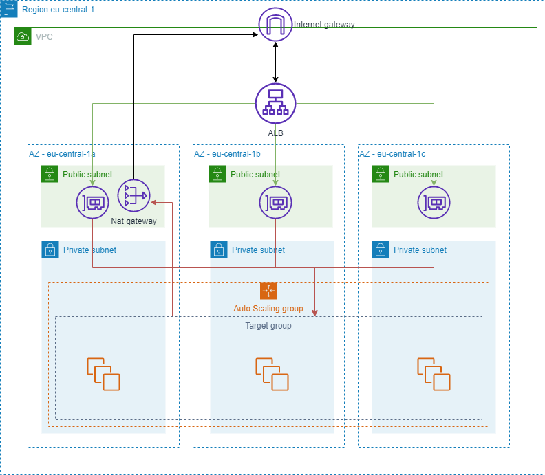
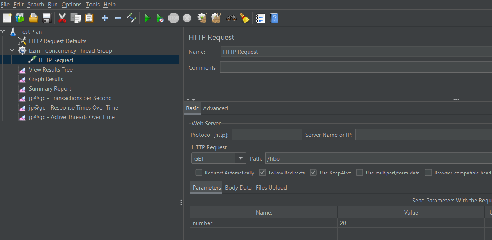

# AWS infrastructure template

# Architecture


### Alarms for ASG
- CPU load > 50% -> add instance
- CPU load < 25% -> remove instance


# Prerequisites
- [aws cli](https://aws.amazon.com/cli/)

# Usage
- You have to create/download from AWS EC2 key (for SSH access), and set parameter `KeyName` in .yaml

### Infrastructure deploy
`aws cloudformation deploy --template .\cloudFormation-autoscaling.yml.yml --myInfra --parameter-overrides KeyName=rk-key-pair`

### Infrastructure deletion
`aws cloudformation delete-stack --stack-name myInfra`


# About image
AmiID: ami-0f121ce69f9e67382

In image is running simple express.js web server, which servers following endpoints:
- /api - shows hostname and uptime
- /kill - kills application
- /fibo?number=49 - calculates fibo number (makes CPU load)

Application is running as a service

Service
```
[Unit]
Description=LTPS NodeJS Test Application
After=network-online.target

[Service]
Restart=on-failure
WorkingDirectory=/
ExecStart=/.nvm/versions/node/v16.8.0/bin/node /home/ec2-user/expressApp/app.js

[Install]
WantedBy=multi-user.target
```

# JMeter
- packages needed: 3-Basic graphs
To test load, download [jMeter](https://jmeter.apache.org/) and import `LoadTests.jmx` file
Then set URL path (see ALB dns) and click green run button. In `View results tree` tab  you can see response messages.



# Errors:
During stress test, this solution's got following errors:

```
Error1
org.apache.http.conn.HttpHostConnectException: Connect to rk-ASG-ALB-634218825.eu-central-1.elb.amazonaws.com:80 [rk-ASG-ALB-634218825.eu-central-1.elb.amazonaws.com/35.156.132.51, rk-ASG-ALB-634218825.eu-central-1.elb.amazonaws.com/52.57.178.162] failed: Connection timed out: no further information

Error2
java.net.UnknownHostException: rk-ASG-ALB-634218825.eu-central-1.elb.amazonaws.com

```
