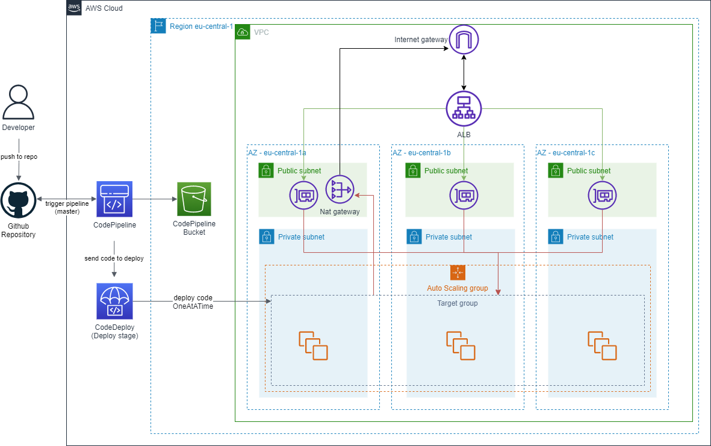

# AWS infrastucture templates

# Infrastucture 1
## cloudFormation-autoscaling.yml


### Config:
Important parameters

```yaml
Parameters:
  ResourcePrefix:
    Default: RESOURCES_PREFIX
  KeyName:
    Default: KEY_NAME
  RegionName:
    Default: REGION_NAME
```

### About image
AmiID: `ami-0f121ce69f9e67382`

In image is running simple express.js web server, which servers following endpoints:
- /api - shows hostname and uptime
- /kill - kills application
- /fibo?number=49 - calculates fibo number (makes CPU load)

Application is running as a service

Service
```
[Unit]
Description=LTPS NodeJS Test Application
After=network-online.target

[Service]
Restart=on-failure
WorkingDirectory=/
ExecStart=/.nvm/versions/node/v16.8.0/bin/node /home/ec2-user/expressApp/app.js

[Install]
WantedBy=multi-user.target
```

### JMeter
- packages needed: 3-Basic graphs
To test load, download [jMeter](https://jmeter.apache.org/) and import `LoadTests.jmx` file
Then set URL path (see ALB dns) and click green run button. In `View results tree` tab  you can see response messages.


# Infrastucture 2 (CI-CD)

## cloudFormation-autoscaling-CICD.yml


### Config:
You should setup some additional parameters.

```yaml
Parameters:
  ...
  KeyName:
    Default: KEY_NAME
  RegionName:
    Default: REGION_NAME
  BranchName:
    Default: BRANCH_NAME
  RepositoryName:
    Default: REPOSITORY_NAME
  GitHubOwner:
    Default: REPOSITORY_OWNER
  SecretPath:
    Default: xx/xxxx/token
```

---

# Prerequisites
- [aws cli](https://aws.amazon.com/cli/)

# Usage
- You have to create/download from AWS EC2 key (for SSH access), and set parameter `KeyName` in .yaml

### Infrastructure1 deploy
`aws cloudformation deploy --template .\cloudFormation-autoscaling.yml.yml --stack-name STACK_NAME --parameter-overrides KeyName=rk-key-pair`

### Infrastructure1 deletion
`aws cloudformation delete-stack --stack-name STACK_NAME`

### Infrastructure2 deploy
`aws cloudformation deploy --template .\cloudFormation-autoscaling-CICD.yml --stack-name STACK_NAME --capabilities CAPABILITY_NAMED_IAM`

---